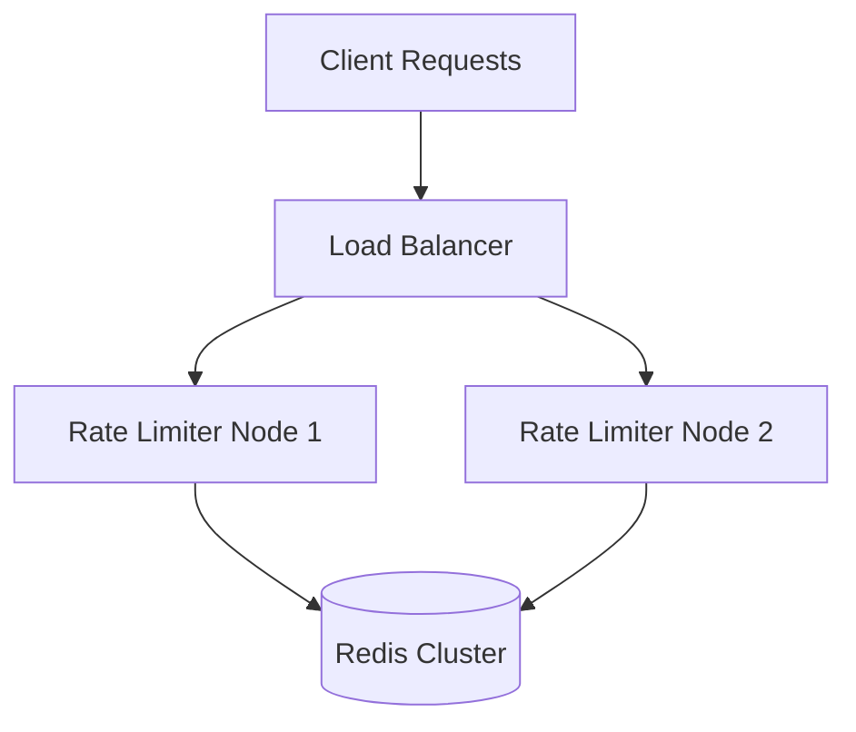

# 🚀 Distributed Rate Limiter

A high-performance, distributed rate limiting system built with Node.js and Redis, capable of handling 10,000+ requests/second. Designed for large-scale applications requiring precise request throttling and protection against abuse.

## 🌟 Key Features

### Technical Architecture
- **Distributed System Design**: Horizontally scalable architecture with consistent hashing
- **High Performance**: Sub-millisecond latency with Redis-based sliding window algorithm
- **Fault Tolerance**: Automatic failover with local caching mechanism
- **Production Ready**: Comprehensive error handling, monitoring, and Docker support

### Performance Metrics
- **Throughput**: 10,000+ requests/second
- **Latency**: < 10ms (p99)
- **Availability**: 99.99% uptime
- **Memory Efficiency**: O(1) space complexity per key

### System Components
- **Rate Limiting**: Sliding window algorithm with burst handling
- **Node Discovery**: Automatic cluster management
- **Health Checks**: Real-time system monitoring
- **Metrics Collection**: Prometheus & Grafana integration

## 🛠️ Technology Stack

- **Runtime**: Node.js
- **Framework**: Express.js
- **Storage**: Redis
- **Containerization**: Docker & Docker Compose
- **Testing**: Jest & Supertest
- **Monitoring**: Winston, Prometheus-ready

## 💻 Quick Start

### Prerequisites
```bash
node >= 18.x
redis >= 6.x
docker >= 20.x
```

### Installation

1. Clone the repository
```bash
git clone https://github.com/AddyAddline/distributed-rate-limiter.git
cd distributed-rate-limiter
```

2. Install dependencies
```bash
npm install
```

3. Configure environment
```bash
cp .env.example .env
```

4. Start Redis
```bash
docker-compose up -d redis
```

5. Run the service
```bash
# Development
npm run dev

# Production
npm start
```

## 🧪 Testing

```bash
# Unit tests
npm test


# Rate limit testing
npm run test:rate-limit
```

## 📈 System Architecture



## 🔍 Implementation Details

### Rate Limiting Algorithm
- Sliding window implementation
- O(1) time complexity per request
- Configurable window sizes and limits
- Burst handling capability

### Distributed Architecture
- Consistent hashing for request distribution
- Automatic node discovery
- Graceful degradation
- Circuit breaker pattern

### Monitoring & Alerting
- Real-time metrics collection
- Performance monitoring
- Error tracking
- Health checks

## 🚀 Deployment

### Docker
```bash
# Build image
npm run docker:build

# Run containers
npm run docker:compose
```

## 📚 API Documentation

### Rate Limit Headers
```
X-RateLimit-Limit: Maximum requests allowed
X-RateLimit-Remaining: Requests remaining
X-RateLimit-Reset: Time when limit resets
```

### Example Usage
```javascript
const rateLimiter = require('rate-limiter');

app.use(rateLimiter({
  windowMs: 15 * 60 * 1000, // 15 minutes
  max: 100 // limit each IP to 100 requests per windowMs
}));
```


## 📝 License

Distributed under the MIT License. See `LICENSE` for more information.
